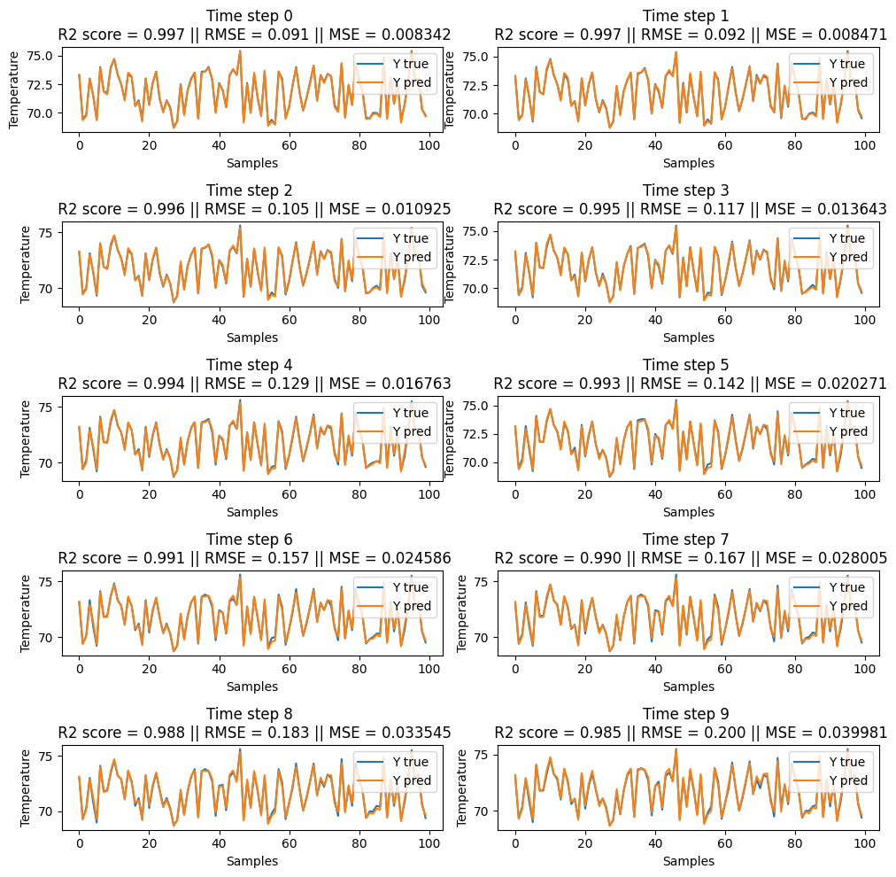

## Temperature Dynamics Prediction using Neural Networks

This repository contains code to learn the temperature dynamics by using a neural network model for the task of model predictive control.

## Results

The figure below presents the results of predicting the temperature over a horizon of 10 time steps using the trained neural network model.

